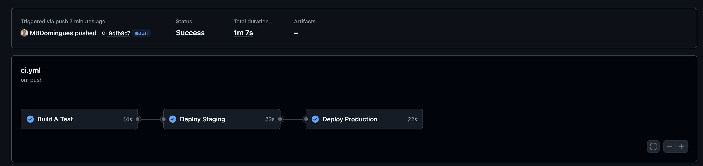
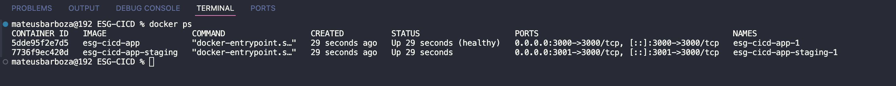
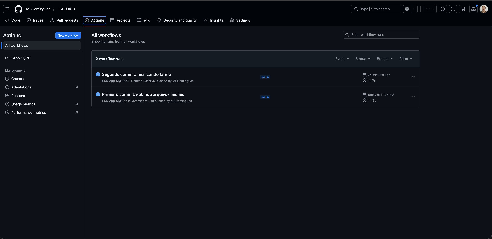
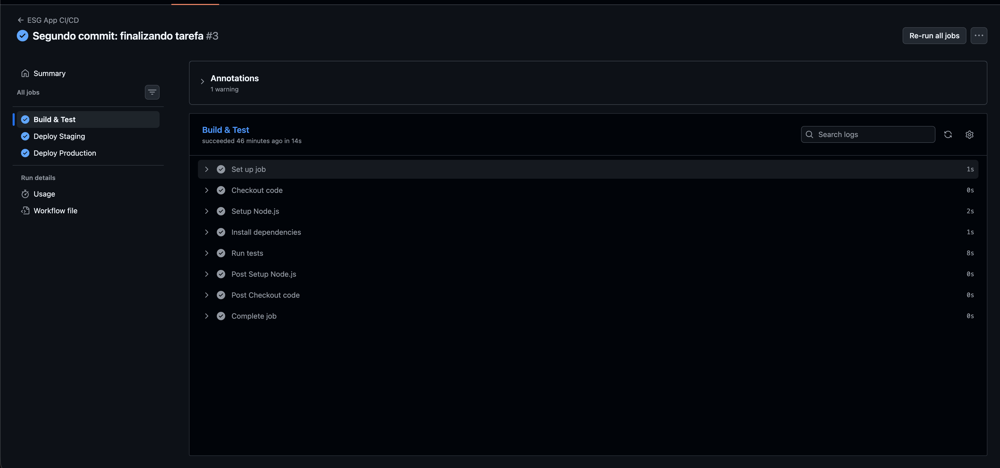
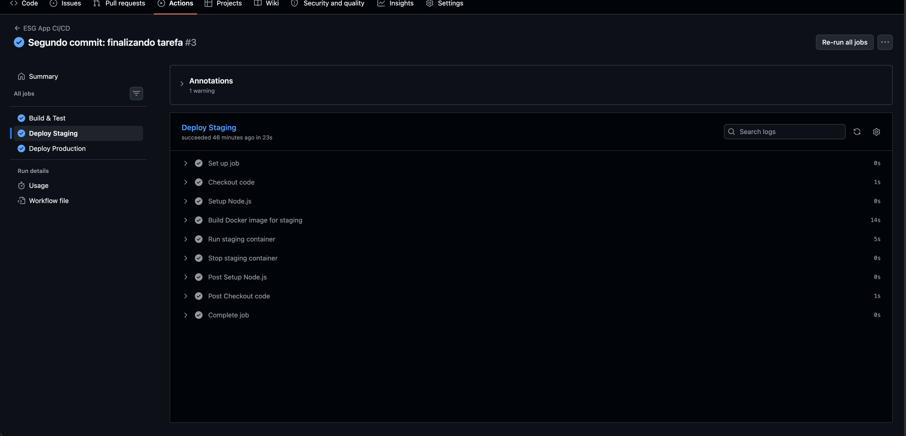
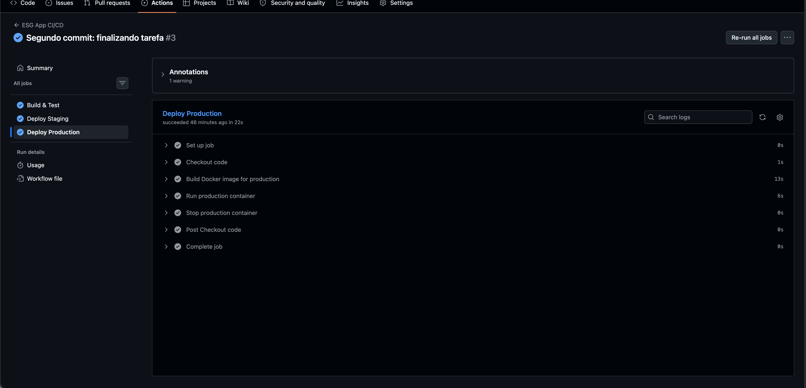
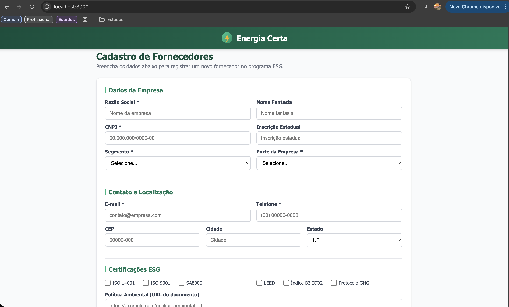
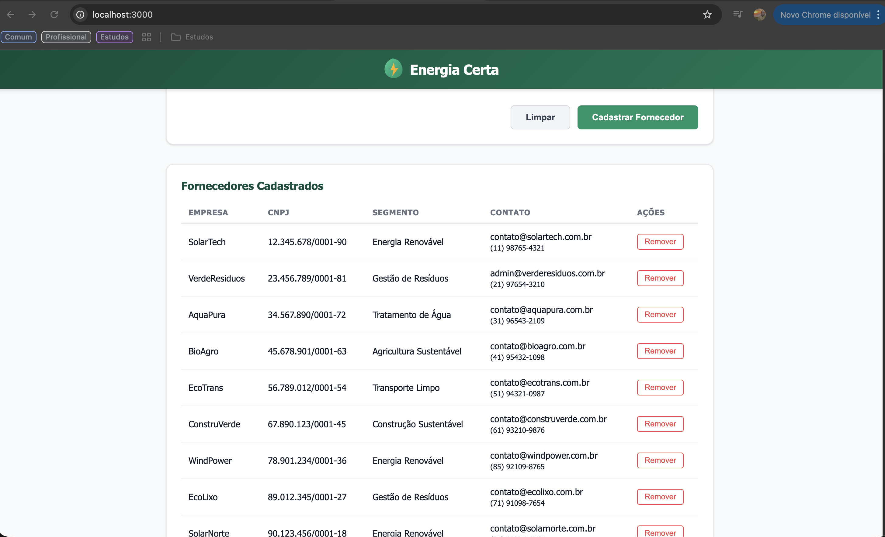

# Projeto - Cidades ESGInteligentes

Sistema de cadastro de fornecedores com banco de dados SQLite e pipeline CI/CD via GitHub Actions.

## Como executar localmente com Docker

```bash
docker compose up --build
```

Acesse `http://localhost:3000` — ambiente de produção.
Ambiente de staging roda em `http://localhost:3001`.

## Pipeline CI/CD

Utiliza **GitHub Actions** (`.github/workflows/ci.yml`) com 3 jobs:

1. **Build & Test** — instala dependências, sobe o servidor e executa os testes automatizados
2. **Deploy Staging** — builda imagem Docker, inicia container e valida health check na porta 3001
3. **Deploy Production** — builda imagem Docker, inicia container e valida health check na porta 3000

A pipeline dispara em pushes para `main` e em pull requests.

## Containerização

### Dockerfile

```dockerfile
FROM node:20-alpine
RUN apk add --no-cache python3 make g++
WORKDIR /app
COPY package.json .
RUN npm install --production
COPY . .
RUN mkdir -p /app/data
EXPOSE 3000
CMD ["node", "src/server.cjs"]
```

- Node.js 20 Alpine
- Compila `better-sqlite3` com `g++`
- Dados persistidos via volume Docker

### docker-compose.yml

- `app` — produção (porta 3000)
- `app-staging` — staging (porta 3001)
- Volumes separados para dados
- Rede bridge isolada (`esg_network`)
- Healthcheck configurado

## Prints do funcionamento

















## Tecnologias utilizadas

- **Backend:** Node.js + Express
- **Banco de Dados:** SQLite (better-sqlite3)
- **Frontend:** HTML5, CSS3, JavaScript vanilla
- **CI/CD:** GitHub Actions
- **Containerização:** Docker + Docker Compose
- **Testes:** Node.js `assert` (sem dependências externas)
- **Tema ESG:** Eficiência energética e sustentabilidade — monitoramento de consumo, alertas automáticos, auditorias de conformidade
